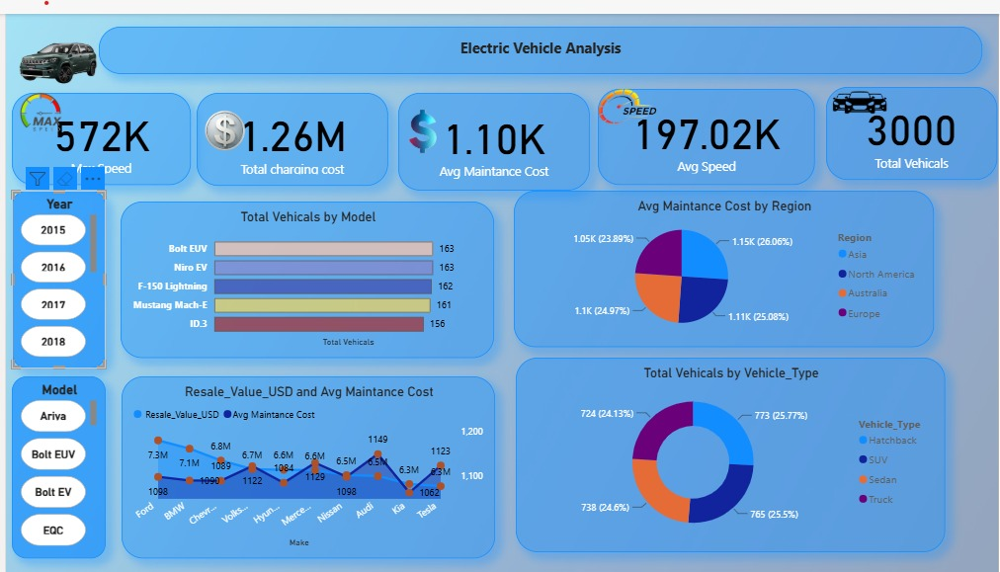

# Electric Vehicle Data Analytics Dashboard

## Project Overview
The objective is to understand vehicle characteristics, maintenance costs, charging costs, resale values, vehicle types, regions, and performance metrics through an interactive dashboard.

## Tools Used
* Microsoft Power BI
* Power Query
* DAX
* Microsoft Excel / CSV
* GitHub

## Dataset
The dataset contains **3,000 electric vehicle records** with 25 attributes.
Important columns include:
* Vehicle ID
* Make
* Model
* Year
* Region
* Vehicle Type
* Battery Capacity
* Battery Health
* Range
* Charging Power
* Charging Time
* Mileage
* Average Speed
* Maximum Speed
* Maintenance Cost
* Monthly Charging Cost
* Resale Value

## Dashboard Features
The Power BI dashboard provides the following analysis:
1. Total Number of Vehicles
2. Total Charging Cost
3. Average Maintenance Cost
4. Average Speed
5. Total Vehicles by Model
6. Average Maintenance Cost by Region
7. Resale Value and Average Maintenance Cost by Make
8. Total Vehicles by Vehicle Type
9. Year-wise filtering
10. Model-wise filtering

## Key Dashboard Metrics
The dashboard displays:
* **Total Vehicles:** 3,000
* **Total Charging Cost:** approximately $1.26M
* **Average Maintenance Cost:** approximately $1.10K
The dashboard also provides interactive filters for **Year** and **Model**.

## Project Workflow
The project follows these steps:
1. Collected the electric vehicle dataset.
2. Loaded the data into Power BI.
3. Cleaned and transformed the data using Power Query.
4. Created calculated measures using DAX.
5. Built interactive charts and KPI cards.
6. Added Year and Model slicers.
7. Designed the final Power BI dashboard.
8. Published the project files on GitHub.

## Dashboard Preview



## Files Included
```text
data/
    electric_vehicle_analytics.csv

powerbi/
    Electric_Vehicle_Analysis.pbix

screenshots/
    electric_vehicle_dashboard.png

documentation/
    project_notes.md
```

## Business Questions Answered
* How many electric vehicles are included in the dataset?
* Which vehicle models have the highest number of vehicles?
* Which regions have higher maintenance costs?
* What is the relationship between resale value and maintenance cost?
* Which vehicle types are most common?
* How do vehicle results change by year and model?
* What are the overall charging and maintenance costs?

## Conclusion
This project demonstrates how Power BI can be used to transform raw electric vehicle data into an interactive business dashboard.
The dashboard helps users quickly understand vehicle distribution, maintenance expenses, charging costs, resale value, regional trends, and vehicle-type distribution.

## Author
Dheeraj Pal

